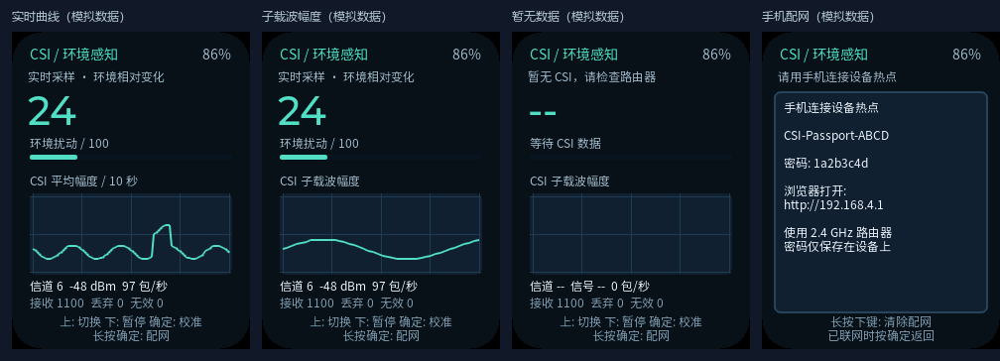

**English** · [简体中文](README.md)

# AI Passport CSI · ESP32-C3

Repository: `ai-passport-csi-esp32c3`

**Turn AI Passport into a portable Wi-Fi CSI scope.**

An experimental firmware based on [FoloToy AI Passport](https://github.com/FoloToy/ai-passport). It collects Wi-Fi Channel State Information (CSI) with ESP32-C3 and displays signal amplitude and relative environmental disturbance on the device screen.

Use it to learn about CSI, observe environmental changes, and run Wi-Fi sensing experiments.

> This is an amplitude and disturbance observation prototype. It does not produce room maps, 3D point clouds, body outlines, or person coordinates. Its disturbance score is not an occupancy probability.



This preview uses simulated data; it is not a screenshot of live device samples.

## Features

- **Live amplitude trace:** observe approximately 10 seconds of CSI amplitude history.
- **Subcarrier amplitude plot:** display the amplitude of 42 selected subcarriers.
- **Background calibration:** compare against a quiet environment to calculate a relative 0–100 disturbance score.
- **Sampling status:** display valid frames, queue drops, invalid frames, and measured sample rate.
- **Chinese UI and local provisioning:** connect a phone to the device hotspot and configure the router through a local web page.
- **Button controls:** switch plots, pause rendering, recalibrate, and reopen provisioning.

## Requirements

| Item | Requirement |
| --- | --- |
| Device | FoloToy AI Passport, ESP32-C3, 8 MB Flash |
| Router | 2.4 GHz Wi-Fi, compatible 20 MHz OFDM/HT packets, gateway responds to Ping |
| Phone | Initial local provisioning |
| USB data cable and computer | Building, flashing, and viewing logs |
| Development environment | ESP-IDF 5.5.3 and the project's locked dependencies |

Sampling requires a router connection. **Internet access is not required.** Compatibility and actual sample rate depend on the router and wireless link.

## How it works

```text
AI Passport ──periodic Ping──▶ Router
AI Passport ◀──Wi-Fi reply─── Router
     │
     └─ CSI I/Q → Subcarrier amplitude → Background comparison → Display
```

Obstructions and multipath reflections affect Wi-Fi propagation. The firmware extracts CSI from received packets, calculates amplitude for 42 selected subcarriers, and compares the normalized amplitude shape against a background reference.

People, pets, fans, furniture changes, interference, and movement of the device itself can affect the readings. Keep both the device and router stationary during experiments.

## Download firmware

Verified merged image: [CSI-Scope-full.bin](assets/firmware/CSI-Scope-full.bin).
See the [firmware guide](assets/firmware/README.md) for flashing, SHA-256 checksums, and validation scope.

## Build and flash

Run these commands in a terminal with ESP-IDF 5.5.3 activated. The validation script requires Bash; see the development documentation for Windows setup.

```bash
idf.py set-target esp32c3
./tools/validate.sh --firmware
```

After validation, the merged image is `build/FoloToy-AI-Passport-full.bin`, flashed at `0x0`. It replaces the original firmware and may reset stored settings. Save any settings you need beforehand.

For incremental development:

```bash
idf.py build
idf.py -p <PORT> flash monitor
```

See [Build and Test](docs/development/engineering/build-and-test.md).

## Start an experiment

1. Power on and connect your phone to the `CSI-Passport-XXXX` hotspot shown on the screen, using the displayed password.
2. Stay connected when the phone reports no Internet, then open `http://192.168.4.1`.
3. Enter your 2.4 GHz router's Wi-Fi name and password.
4. After connection, keep the device and router stationary and the environment quiet until calibration finishes. Calibration requires at least 8 seconds and 100 valid samples.
5. Walk between the device and router and compare the traces and scores against the quiet environment.

Wi-Fi credentials are stored locally on the device. After a successful connection, the provisioning hotspot and web service stop.

| Button | Action |
| --- | --- |
| Up | Switch between the time trace and subcarrier plot |
| Down | Pause or resume plot rendering; acquisition and scoring continue |
| Confirm | Recalibrate the background |
| Hold Confirm | Open provisioning and pause sampling |
| Confirm during provisioning | Return to sampling if still connected to the router |
| Hold Down during provisioning | Clear this application's saved Wi-Fi credentials |

## Interpreting readings

- **Amplitude:** arbitrary units, not dBm, distance, or calibrated field strength.
- **Disturbance score:** an experimental relative metric, not a person count, occupancy probability, or validated detection result.
- **Sample rate:** measured. Ping targets a 10 ms interval; a fixed number of valid CSI frames per second is not guaranteed.
- **No data:** shown after 1.5 seconds without valid CSI. The background is relearned when data resumes.

Range, sensitivity, false alarms, and battery life require systematic device measurements. Localization, respiration detection, and activity classification are not implemented.

## Roadmap

Planned features, not yet implemented:

- [ ] On-device CSI amplitude heatmap
- [ ] Raw I/Q export with timestamps, channel, and other metadata
- [ ] Desktop amplitude, phase, RSSI plots, and heatmaps
- [ ] Recording and replay for repeatable algorithm comparisons
- [ ] Sampling quality diagnostics and standardized experiment records

## Development and validation

CSI host tests cover amplitude calculation, gain normalization, background calibration, amplitude-shape changes, and data outages. Host tests do not establish performance in real radio environments.

See the [CSI Scope guide](docs/csi-scope.md) for implementation details and limitations. Reproducible issues, router compatibility results, and experiment records are welcome.

## Credits and license

Based on [FoloToy/ai-passport](https://github.com/FoloToy/ai-passport). Thanks to the upstream project for the hardware platform and firmware foundation.

For CSI reference material, see [Espressif ESP-CSI](https://github.com/espressif/esp-csi).

This project retains the upstream MIT License and copyright notice. See [LICENSE](LICENSE).